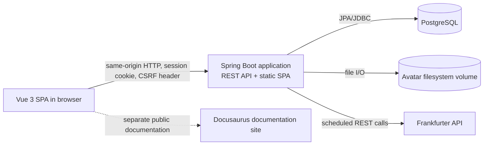
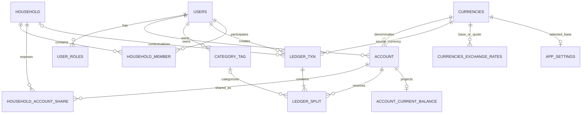

# Pocketr Thesis Project Reference

> Purpose: verified source material for writing a master's thesis about Pocketr in ChatGPT Work.
>
> This is not the thesis itself. It is a compact, structured description of the implemented system.
> When this file conflicts with archived plans or the public roadmap, the current source code and
> runtime configuration are authoritative.

## 0. Reference status

| Item | Value |
|---|---|
| Repository snapshot | `master` at commit `2bb2793eb952d7992e572ccb4b441824e2eaee56` |
| Snapshot commit date | 2026-06-29 |
| Reference prepared | 2026-08-22 |
| Product | Pocketr |
| Repository license | MIT |
| Copyright holder in `LICENSE` | Milen Valchev |
| Evidence used | Current backend, frontend, database schema, tests, Docker configuration, GitHub workflows, and current documentation |

Rules for using this file:

1. Do not turn planned or missing features into implemented features.
2. Do not infer the author's motivation, research method, deployment hardware, production URL,
   user study, performance results, or academic conclusions. These facts are not in the repository.
3. Describe a feature as current only when it is confirmed by current implementation.
4. Treat `docs/archived/` as historical design material, not current behavior.
5. The public roadmap contains stale entries. In particular, it calls multi-currency support
   planned, while the current code already implements account currencies and exchange-rate
   conversion.
6. If the repository changes, re-verify this document before using it as final thesis evidence.

## 1. Project summary

Pocketr is a self-hosted, open-source web application for personal and household finance tracking.
It lets registered users create financial accounts, record balanced transactions, categorize
spending, inspect balances and reports, and share selected accounts with one household.

The central technical decision is a double-entry ledger. A user sees familiar actions such as
expense, income, transfer, and debt payment, while the backend stores every action as a transaction
with at least two debit/credit splits. This separates the simple user interface from the accounting
model used to preserve balance correctness.

The application is a modular monolith:

- a Vue 3 single-page application is the browser client;
- a Kotlin/Spring Boot application exposes the HTTP API and serves the production SPA;
- PostgreSQL stores users, household relationships, accounts, currencies, ledger data, and balance
  snapshots;
- uploaded avatars are stored on the server filesystem;
- Frankfurter is the external source for currency metadata and exchange rates;
- Docker Compose is the documented self-hosting mechanism;
- a separate Docusaurus site contains the public project documentation.

The repository does not contain evidence about the actual production host, domain, TLS setup,
backup policy, monitoring system, number of users, measured performance, or deployment hardware.

## 2. Problem domain and system goals

### 2.1 Problem addressed

The implemented system addresses these concrete needs:

- tracking money held in assets and owed as liabilities;
- recording income, expenses, asset transfers, and debt payments consistently;
- organizing spending with user-owned categories;
- showing current availability, period spending, trends, and recent expenses;
- working in either an individual view or a shared household view;
- supporting accounts in different currencies;
- keeping deployment and financial data under the user's control through self-hosting.

### 2.2 Verified product goals

The repository README and public introduction state these goals:

- simple day-to-day budgeting over a reliable accounting foundation;
- data integrity through double-entry bookkeeping;
- personal and household finance management;
- self-hosting and user control of data;
- open-source availability and long-term maintainability;
- security-conscious access to private financial data.

The repository does not provide a formal requirements specification, competitor study, survey,
business plan, or measured evaluation of these goals.

### 2.3 Actors

| Actor | Current capabilities |
|---|---|
| Guest | Open the SPA, register, log in |
| Authenticated user | Manage own profile preferences, accounts, categories, transactions, balances, reports, and household participation |
| Household owner | All member capabilities; invite users and update household rollover day |
| Household admin | Model and authorization support inviting users and updating rollover day; no current API/UI assigns this role |
| Household member | Accept an invitation, view the household, share/unshare own accounts, use authorized household data, leave the household |
| Application scheduler | Refresh currency catalog and exchange rates at startup and on a fixed delay |
| Frankfurter service | Provide currency definitions and exchange rates |
| Operator | Configure and run Pocketr and PostgreSQL, persist database/avatar volumes, and publish releases |

## 3. Current functional scope

### 3.1 Authentication and session lifecycle

- Public registration accepts email, password, first name, and last name.
- Passwords are encoded with BCrypt before storage.
- Spring Security form login accepts `email` and `password`.
- Authentication is stateful and session-based; it does not use JWT.
- The configured session timeout is five minutes.
- Spring Security is configured for a maximum of one session per user.
- The client restores authentication by requesting the current user when entering the app.
- Protected routes redirect unauthenticated users to login and preserve a sanitized internal return
  path.
- A visible browser tab checks the session again after the page returns from the background.
- A `401` response clears client-side domain stores and redirects to login with a session-expired
  message.
- Logout invalidates the server session, clears the authenticated user state, and returns to login.

There is no implemented email verification, password reset, multi-factor authentication, account
deletion, or password/profile-name editing workflow.

### 3.2 User profile and preferences

- The authenticated user can view name and email.
- The user can upload or replace an avatar.
- Accepted avatar content types are JPEG, PNG, GIF, and WebP.
- The maximum avatar upload and request size is 5 MB.
- Avatar files are stored under a configured server directory using generated filenames.
- Replaced avatar files are deleted when possible.
- Avatar bytes are returned to the client as Base64 data URLs, not as separate public media URLs.
- The user can choose English, Bulgarian, or German in the UI.
- The chosen language is persisted on the user record and cached in browser local storage.
- The initial unauthenticated language is selected from local storage, then browser preferences,
  with English as fallback.
- The user can set an individual rollover day from 1 to 31.
- The user can select light, dark, or system-driven theme mode. The current theme preset is named
  `pocketr`.

### 3.3 View modes

The application has two view modes:

- `INDIVIDUAL`: the user works with personal accounts and personal transaction/report scope.
- `HOUSEHOLD`: the user selects a household and works with household-visible accounts,
  transactions, and reports.

The selected mode is stored in browser local storage. On protected navigation, the client validates
the persisted household against current memberships and falls back to individual mode when it is
stale.

### 3.4 Accounts

User-creatable account types are:

| Type | Meaning in the application | Normal balance |
|---|---|---|
| `ASSET` | Money or value owned, such as cash or a bank account | Debit |
| `LIABILITY` | Money owed, such as credit-card debt or a loan | Credit |
| `INCOME` | Source of earned or received money | Credit |
| `EXPENSE` | Spending destination/category account | Debit |

`EQUITY` also exists in the accounting model but is system-managed. Users cannot create it manually,
and the frontend hides it from account lists and selectors.

Account functions:

- create an asset, liability, income, or expense account;
- choose an account-level ISO currency from the synchronized currency catalog;
- optionally assign a non-zero opening amount and date to asset and liability accounts;
- allow positive or negative opening asset amounts;
- require opening liability debt to be positive;
- rename an account owned by the authenticated user;
- list and filter accounts by type and currency;
- display current account balances;
- display whether an account is explicitly shared in household mode.

There is no account deletion, archival, currency change, or type change endpoint/UI.

For each owner, the database requires the combination of account type, currency, and name to be
unique.

### 3.5 Opening balances and opening debt

An opening amount is not stored as a mutable field on the account. It is posted through the same
ledger as every other financial event.

- The system finds or creates one `Opening Equity` account per user and currency.
- Creation is protected by a pessimistic lock on the user row to prevent duplicate equity accounts
  under concurrent requests.
- A positive asset opening amount posts debit Asset / credit Opening Equity.
- A negative asset opening amount posts credit Asset / debit Opening Equity.
- A liability opening debt posts credit Liability / debit Opening Equity.
- Opening Equity accounts are not exposed as normal user-managed accounts.

This design keeps initial values auditable in transaction history and avoids a second balance source.

### 3.6 Categories

- Categories are private to their owner.
- A category has a name, optional seven-character color value, creation timestamp, and UUID.
- The UI provides a preset color palette and a no-color option.
- Category names are checked case-insensitively for duplicates by the service.
- Categories can be created, renamed/recolored, listed, and deleted.
- A category referenced by a ledger split cannot be deleted because the database relationship is
  restrictive; the API returns a conflict.
- Categories are optional on expense transactions.

### 3.7 Transactions

The user-facing creation dialog provides four workflows:

| Workflow | User-selected accounts | Ledger pattern |
|---|---|---|
| Expense | Pay-from asset or liability; expense account | Credit pay-from / debit expense |
| Income | Deposit asset; income account | Debit asset / credit income |
| Transfer | Source asset; destination asset | Credit source / debit destination |
| Debt payment | Paying asset; liability account | Credit asset / debit liability |

Each workflow also accepts a date, positive amount, transaction currency derived from its source
account, and an optional description. Expense also accepts an optional category.

Transaction functions:

- create a balanced transaction;
- list transactions newest first by transaction date and creation time;
- classify display kind as expense, income, transfer, debt payment, opening balance, or opening debt;
- expand a transaction row to inspect debit and credit splits;
- show the creator's name/email/avatar in household mode;
- filter server-side by date range, account, and category;
- search the loaded page by description in the browser;
- paginate with a default page size of 15;
- delete an authorized transaction after confirmation.

There is no transaction update/edit endpoint/UI, attachment/receipt support, import, recurring
transaction engine, or bank synchronization.

### 3.8 Ledger invariants

Before a transaction is persisted, the backend enforces:

1. at least two splits;
2. every split amount is greater than zero;
3. every split side is exactly `DEBIT` or `CREDIT`;
4. the sum of request debit amounts equals the sum of request credit amounts;
5. every referenced account exists;
6. the transaction currency exists;
7. every referenced category exists and belongs to the creator;
8. individual/household ownership and sharing rules are satisfied.

Transactions and their splits are written in one database transaction. Current-balance snapshot
deltas are updated inside the same transaction. A snapshot failure therefore causes the whole write
to roll back.

### 3.9 Balances

Money is stored as signed-safe integer minor units (`Long`/PostgreSQL `bigint`), not floating-point
amounts. Examples: EUR 10.50 is stored as `1050`; JPY 10 is stored as `10`.

Raw ledger balance is calculated as debits minus credits. Presentation then applies account normal
balance:

- asset and expense balances use the raw value;
- liability, income, and equity balances invert the raw value for user-facing display.

Balance behavior:

- asset, liability, income, and equity balances are lifetime balances up to the requested date;
- expense balances cover the rollover period containing the requested date;
- individual expense periods use the user's rollover day;
- household expense periods use the household rollover day;
- days 29-31 are clamped to the last valid day of shorter months;
- historical balances are calculated from ledger splits;
- current non-expense balances can use the `account_current_balance` projection for faster reads.

The snapshot projection is maintained by atomic PostgreSQL upsert/increment statements. Account IDs
are updated in stable order to reduce deadlock risk. At application startup, the backend compares
snapshot values with values recomputed from the ledger:

- healthy accounts can use snapshot reads;
- mismatched accounts fall back to computed ledger totals;
- if the integrity check itself fails, snapshot reads are disabled globally;
- a repository repair operation exists, but it is not exposed through an API or UI.

### 3.10 Multi-currency behavior

- Every account has one currency.
- Every transaction has one source/transaction currency.
- The UI derives transaction currency from the pay-from, deposit, or source account.
- Request debit/credit equality is validated before currency conversion.
- The backend converts each requested split from transaction currency into the target account's
  currency.
- The converted minor amount and effective exchange rate are persisted on each split.
- Same-currency conversion uses rate `1`.
- Cross rates are derived through the configured base currency, which defaults to EUR.
- Decimal calculations use `BigDecimal`; final minor-unit conversion uses half-up rounding.
- Exchange rates are stored with precision 38 and scale 18.
- A missing required rate rejects transaction creation.

The database is seeded with a fallback set of 15 currencies if the catalog is empty: EUR, USD, GBP,
JPY, CHF, BHD, CAD, AUD, SEK, NOK, DKK, PLN, CZK, HUF, and RON.

At application startup and then after a configurable fixed delay (24 hours by default), the backend:

1. requests the currency catalog from Frankfurter;
2. updates name, symbol, and minor-unit metadata;
3. requests rates for the configured base currency;
4. replaces the stored rate set for that base currency.

External client timeouts are three seconds for connection and five seconds for response reading.
When synchronization fails or returns no data, the application logs the problem and keeps existing
catalog/rates.

### 3.11 Household collaboration

Household design is an overlay over user-owned data. Accounts remain owned by individuals and are
made household-visible through explicit account-share rows.

Current household rules:

- a user can be active in at most one household;
- a user may have pending invitations before joining a household;
- creating a household makes the creator an active `OWNER`;
- creating or joining a household removes the user's other pending invitations;
- only an active owner or admin can invite a member;
- an invited user must already have a Pocketr account;
- invitees enter as `MEMBER` with status `INVITED`;
- an invitation cannot be accepted while the user is active in another household;
- any active member can share or unshare an account they own;
- a member cannot share or unshare another user's account;
- owners/admins can set a household rollover day from 1 to 31;
- any active member can leave;
- leaving removes that user's account shares from the household;
- if the owner leaves, an active admin is promoted, otherwise the first remaining active member is
  promoted;
- if the final active member leaves, the household, remaining invitations, and shares are deleted.

The role enum supports `OWNER`, `ADMIN`, and `MEMBER`, but no current public endpoint or UI changes
roles. Therefore the normal implemented invitation flow creates owners and members, not admins.

Household visibility and posting rules:

- a household account list contains the current user's own accounts plus accounts shared into the
  household, de-duplicated by account ID;
- a household member can read balances only for accounts explicitly shared into that household;
- household transaction history is selected by the presence of any shared account in a transaction;
- this account-based visibility intentionally includes older transactions involving an account
  after that account is shared, even if the transaction has no household ID;
- using another member's account requires active membership and an explicit share;
- cross-user transactions normally allow only asset accounts, supporting household transfers;
- the one exception allows repayment of another user's shared liability from the creator's own
  asset: asset split must be credit and liability split must be debit;
- categories used on a transaction must still belong to the transaction creator.

Transaction deletion is authorized using the involved accounts and current household access rules,
not solely by checking the original creator.

There is no explicit household rename/delete endpoint, member removal endpoint, invitation rejection,
invitation cancellation, or role-management endpoint. A household is implicitly deleted when its
last active member leaves.

### 3.12 Dashboard and reporting

The dashboard responds to individual/household mode and currently shows:

- available money: sum of visible asset balances grouped by currency;
- current rollover-period spending grouped by currency;
- six-period spending trend for EUR;
- ten most recent spending transactions;
- top five spending categories for the current rollover period or lifetime;
- debt payments included in spending reports under the synthetic label `Debt Payment`.

Reporting behavior:

- expense totals are net debit minus credit on expense accounts;
- debt payments are liability debits that have an asset-credit counter-split;
- individual reports select the authenticated user's owned expense/liability accounts;
- household reports include qualifying transactions that contain at least one shared account;
- monthly/rollover reports return exact start and inclusive end dates;
- lifetime reports aggregate without a date limit;
- balances and report values remain separated by currency rather than being summed into a false
  cross-currency total.

The backend also exposes:

- a summary of all balances for the user's owned accounts as of a date;
- a daily cumulative balance time series for one owned account and date range.

Those two reporting APIs have no current page-level frontend consumer.

Dashboard presentation limitations:

- the six-period trend is fixed to EUR;
- the category chart selects EUR when present, otherwise the alphabetically first currency with
  data, and displays only one currency at a time;
- description search on the transaction page filters only the currently loaded server page.

### 3.13 Public documentation

`pocketr-docs/` is a separate Docusaurus site configured for `https://docs.pocketr.app` and GitHub
Pages. It includes an introduction, deployment/getting-started guide, roadmap, and blog support. The
current guides page is only a placeholder, so the repository does not yet contain a complete public
user manual.

## 4. User guide

### 4.1 Deploy with Docker Compose

Prerequisites confirmed by the repository: Docker with Compose support and a host that can persist
Docker volumes.

1. Obtain `docker-compose.yaml`.
2. Create a `.env` file with at least:

   ```dotenv
   POSTGRES_PASSWORD=replace-with-a-strong-password
   ```

3. Optionally configure image version, bind address, and port:

   ```dotenv
   POCKETR_VERSION=latest
   POCKETR_BIND_ADDRESS=0.0.0.0
   POCKETR_PORT=8081
   ```

4. Start the services:

   ```bash
   docker compose up -d
   ```

5. Open `http://<host>:<configured-port>` if no external reverse proxy is used.

The production-oriented Compose file starts the Pocketr image and PostgreSQL. It persists database
data and avatar files in named volumes. PostgreSQL is not published to the host. The Pocketr HTTP
port is published and defaults to all interfaces on port 8081.

The Compose file does not configure TLS. A public deployment needs separately supplied HTTPS/TLS
termination and related operational controls; the actual thesis deployment arrangement is not
recorded in this repository.

An external PostgreSQL server can be used by supplying `DB_URL`, `DB_USERNAME`, and `DB_PASSWORD`
and starting only `pocketr-app` with `--no-deps` as documented in `pocketr-docs/docs/getting-started.mdx`.

### 4.2 Register and log in

1. Open the registration page.
2. Enter first name, last name, email, password, and password confirmation.
3. Submit; successful registration returns to the login page.
4. Log in with email and password.
5. Protected pages open at the original safe internal URL or at the dashboard.

The application has no email-verification step.

### 4.3 Recommended first-time setup

The minimum setup depends on the workflow:

- expenses: one asset or liability account and one expense account;
- income: one asset account and one income account;
- transfers: two asset accounts;
- debt payments: one asset account and one liability account;
- categorization: create one or more optional categories.

Suggested sequence based on UI dependencies, not a mandated financial method:

1. Create asset accounts for cash/bank balances.
2. Add optional opening balances and dates.
3. Create expense accounts used to group spending destinations.
4. Create income accounts used to identify income sources.
5. Create liability accounts and optional opening debt.
6. Create optional colored categories.
7. Record transactions.

### 4.4 Create and manage accounts

1. Open **Accounts**.
2. Choose **New account**.
3. Select Asset, Expense, Income, or Liability.
4. Enter a name and select a currency.
5. For Asset or Liability, optionally enter a non-zero initial amount and opening date.
6. Save the account.
7. Use the type/currency filters to narrow the table.
8. Use the edit action to rename an account you own.

The balance column is loaded in one batch request. System-created equity accounts are hidden.

### 4.5 Manage categories

1. Open **Categories**.
2. Create a category with a unique name and optional preset color.
3. Use edit to rename or recolor it.
4. Use delete to remove an unused category.

A category that is already referenced by a transaction cannot be deleted.

### 4.6 Record an expense

1. Open **Transactions** and choose **New transaction**.
2. Select the Expense tab.
3. Enter date and amount.
4. Select the asset or liability used to pay.
5. Select an expense account.
6. Optionally select a category and enter a description.
7. Submit.

Paying from an asset reduces that asset. Paying from a liability increases the liability.

### 4.7 Record income

1. Select the Income tab.
2. Enter date and amount.
3. Select the destination asset account.
4. Select the income account.
5. Optionally enter a description.
6. Submit.

### 4.8 Transfer money

1. Select the Transfer tab.
2. Enter date and amount.
3. Select source and destination asset accounts.
4. Optionally enter a description.
5. Submit.

In household mode, a transfer can cross users only when access and account-type rules are satisfied.

### 4.9 Record a debt payment

1. Select the Debt payment tab.
2. Enter date and amount.
3. Select the paying asset account.
4. Select the liability being repaid.
5. Optionally enter a description.
6. Submit.

This reduces both the asset balance and displayed debt balance.

### 4.10 Inspect and filter transactions

- Set a date range, account, or category to request a filtered server page.
- Search descriptions to filter the currently loaded page.
- Change page or page size with table pagination.
- Select a row to expand its debit and credit splits.
- Delete a transaction with the row action and confirmation.

### 4.11 Use the dashboard

- Switch individual/household mode from the sidebar.
- Read available asset totals per currency.
- Read spending for the current configured rollover period.
- Inspect the six-period EUR trend.
- Review recent expenses.
- Toggle top categories between current-period and lifetime views.

### 4.12 Create and use a household

1. Open **Settings**.
2. When not active in a household, create one with a name of at least three characters in the UI.
3. The creator becomes owner and enters household mode.
4. Open household settings.
5. Invite an already registered user by email.
6. Share selected accounts from **Your accounts**.
7. The invitee opens personal settings and accepts the pending invitation while not active in
   another household.
8. Members switch between individual and household views from the sidebar.
9. An account owner can later unshare an account.
10. A member can leave from personal settings.

Only owners/admins see the household invite and rollover management functions. Every active member
can share their own accounts.

### 4.13 Change personal settings

- Upload a JPEG, PNG, GIF, or WebP avatar no larger than 5 MB.
- Select English, Bulgarian, or German and save.
- Choose an individual rollover day from 1 through 31 and save.
- Choose light, dark, or automatic theme from the user menu.
- Log out from the user menu.

## 5. System architecture

### 5.1 Runtime context



Production packages the built SPA into the Spring Boot JAR. The browser and API therefore share an
origin, while Spring's SPA controller forwards non-file client routes to `index.html`.

### 5.2 Backend architecture

The backend follows a layered organization:

| Layer | Package/location | Responsibility |
|---|---|---|
| HTTP controllers | `controllers/` | Versioned endpoints, request parameters, response status |
| Security | `config/security/` | Login/logout, session access, CSRF, user loading, 401 behavior |
| Service interfaces and implementations | `services/` | Transactions, authorization boundaries, business rules, conversion, reporting |
| Focused validators | `services/ledger/validations/` | Ledger and household posting invariants |
| DTOs | `entities/dtos/` | API request/response contracts |
| JPA entities | `entities/db/` | Persistent domain model |
| Repositories/projections | `repositories/` | CRUD, specifications, aggregates, native snapshot operations |
| Configuration | `config/`, YAML | REST client, profiles, datasource, scheduling, storage |
| Migration | `db/migration/V1__init.sql` | PostgreSQL schema managed by Flyway |

Controllers use constructor injection. Most mutations are service transactions. Read operations are
marked read-only where appropriate. Ownership checks are centralized partly in `OwnershipGuard`, and
ledger access is decomposed into dedicated validators.

The architecture is a modular monolith, not microservices. There is no internal message broker,
event bus, Redis cache, or separate authentication server.

### 5.3 Frontend architecture

| Layer | Location | Responsibility |
|---|---|---|
| Route views | `src/views/` | Page composition and user workflows |
| Router/guards | `src/router/` | Lazy-loaded routes and authentication checks |
| Pinia stores | `src/stores/` | Auth and domain state, loading/error state, mode persistence |
| HTTP clients | `src/api/` | Typed resource functions built on `ky` |
| Domain types | `src/types/` | TypeScript API models |
| Workflow utilities | `src/utils/` | Transaction strategies, presentation, money parsing, redirect safety |
| Feature components | `src/components/` | Selectors, filters, sidebar, data table, amount input |
| App compositions | `src/components/app/` | Reusable page/dialog/form/status patterns |
| UI primitives | `src/components/ui/` | shadcn-vue-style wrappers around Reka UI primitives |
| Theme | `src/main.css`, `useAppTheme.ts` | Tailwind v4 mappings and semantic light/dark token sets |
| Localization | `src/i18n/` | English, Bulgarian, and German messages |

Routes are lazy-loaded so page views form separate build chunks. Pinia stores are reset centrally
when a session expires. The mode store persists only view selection; financial data comes from the
server.

The client uses a strategy table to translate the four friendly transaction forms into balanced
split requests. This keeps form orchestration separate from debit/credit request construction.

### 5.4 Typical transaction request flow

1. The user selects a transaction tab and fills the form.
2. A frontend strategy validates required selections and a positive amount.
3. The strategy constructs equal debit and credit request splits.
4. The `ky` client includes the session cookie and copies `XSRF-TOKEN` into `X-XSRF-TOKEN`.
5. Spring Security authenticates the session and validates CSRF.
6. The ledger service validates split structure, resources, ownership, and household rules.
7. Each split is converted from transaction currency to account currency.
8. JPA persists the transaction and cascaded splits.
9. Atomic snapshot deltas are applied in stable account order.
10. The transaction commits and is mapped to a display DTO.

## 6. Database design

### 6.1 Relationship overview



### 6.2 Table catalog

| Table | Primary purpose | Key facts |
|---|---|---|
| `users` | Login identity and preferences | Numeric identity PK; unique email; BCrypt password string; names, language, rollover day, avatar path |
| `user_roles` | Spring authorities | Numeric identity PK; FK to user; registration creates role `USER` |
| `account` | User-owned ledger account | UUID PK; type, currency, name, owner, creation time; unique owner/type/currency/name |
| `account_current_balance` | Current raw balance projection | Account UUID is both PK and FK; raw minor amount and update time; cascades on account deletion |
| `category_tag` | User-owned spending category | UUID PK; name/color/owner/created time; unique owner/name at DB collation level |
| `currencies` | Currency catalog | Three-character code PK; minor unit, name, symbol |
| `currencies_exchange_rates` | Current rate set | Composite base/quote PK; positive decimal rate, provider date, update time |
| `app_settings` | Singleton base-currency model | Smallint PK constrained to `1`; FK to currency; repository-tested but not used by current runtime conversion path |
| `household` | Shared-finance group | UUID PK; name, creator, rollover day, creation time |
| `household_member` | User-household membership | Composite user/household PK; role, status, inviter, invite/join timestamps |
| `household_account_share` | Explicit account visibility | Composite account/household PK; sharer and timestamp |
| `ledger_txn` | Transaction header | UUID PK; creator, optional household, date, description, transaction currency, timestamps |
| `ledger_split` | Debit/credit line | UUID PK; transaction, account, side, account-currency minor amount, exchange rate, optional category |

### 6.3 Enumerations and checks

- Account types: `ASSET`, `LIABILITY`, `INCOME`, `EXPENSE`, `EQUITY`.
- Split sides: `DEBIT`, `CREDIT`.
- Household roles: `OWNER`, `ADMIN`, `MEMBER`.
- Membership statuses: `INVITED`, `ACTIVE`.
- Exchange rates must be greater than zero.
- `app_settings.id` must equal 1.

### 6.4 Indexes

The migration defines indexes for:

- account owner;
- ledger transaction creator, date, household, and household/date;
- membership household, household/status, and user/status;
- split account and transaction;
- current-balance snapshot update time.

### 6.5 Persistence policy

- Flyway applies the SQL migration.
- Normal runtime config sets Hibernate `ddl-auto: validate`; Hibernate does not create production
  tables.
- Tests disable Flyway and use Hibernate `create-drop` against PostgreSQL.
- Schema-changing work is currently consolidated into `V1__init.sql` in this repository rather than
  a long immutable migration history.

## 7. HTTP API reference

All business endpoints are under `/api/v1`. Except for registration, login, and the development
CSRF bootstrap endpoint, API endpoints require an authenticated session.

### 7.1 Authentication and user

| Method | Path | Request | Response/behavior |
|---|---|---|---|
| `POST` | `/api/v1/user/register` | JSON: password, email, optional first/last name | `200`, empty body |
| `POST` | `/api/v1/user/login` | Form: email, password | `200` on success; `400` on auth failure |
| `POST` | `/api/v1/user/logout` | Form/empty body with CSRF | `200`, invalidates session |
| `GET` | `/api/v1/user` | — | Current `UserDto` |
| `POST` | `/api/v1/user/avatar` | Multipart field `avatar` | Updated `UserDto` |
| `PATCH` | `/api/v1/user/language` | JSON: `language` | Updated `UserDto` |
| `PATCH` | `/api/v1/user/rollover` | JSON: `rolloverDay` | Updated `UserDto` |
| `GET` | `/api/v1/internal/csrf-token` | — | Development-profile CSRF bootstrap; empty body |

### 7.2 Accounts, categories, and currencies

| Method | Path | Request/query | Response/behavior |
|---|---|---|---|
| `GET` | `/api/v1/accounts` | `mode`, optional `householdId` | Account list for mode |
| `POST` | `/api/v1/accounts` | Name, type, currency, optional opening amount/date | `201`, account |
| `PATCH` | `/api/v1/accounts/{id}` | Optional name | Updated owned account |
| `GET` | `/api/v1/categories` | — | Owner's categories |
| `POST` | `/api/v1/categories` | Name, optional color | `201`, category |
| `PATCH` | `/api/v1/categories/{id}` | Name, optional color | Updated owned category |
| `DELETE` | `/api/v1/categories/{id}` | — | `204`; conflict when in use |
| `GET` | `/api/v1/currencies` | — | Currency catalog |

### 7.3 Ledger and reports

| Method | Path | Request/query | Response/behavior |
|---|---|---|---|
| `GET` | `/api/v1/ledger/transactions` | Mode, household, date/account/category, `spendingOnly`, page, size | Paged transactions |
| `POST` | `/api/v1/ledger/transactions` | Mode, household, date, currency, description, splits | `201`, transaction |
| `DELETE` | `/api/v1/ledger/transactions/{id}` | — | `204` after access validation |
| `GET` | `/api/v1/ledger/accounts/{id}/balance` | Optional `asOf`, optional `householdId` | One balance |
| `GET` | `/api/v1/ledger/accounts/balances` | Repeated `accountIds`, optional `asOf`/`householdId` | Batch balances |
| `GET` | `/api/v1/ledger/reports/balances` | Optional `asOf` | All owned account balance summaries |
| `GET` | `/api/v1/ledger/reports/monthly` | Mode, `yyyy-MM` period, optional household | Legacy list form of rollover expenses |
| `GET` | `/api/v1/ledger/reports/expenses` | Mode, `yyyy-MM` period, optional household | Period dates plus expense entries |
| `GET` | `/api/v1/ledger/reports/expenses/lifetime` | Mode, optional household | Lifetime expense entries |
| `GET` | `/api/v1/ledger/reports/timeseries` | Account, `dateFrom`, `dateTo` | Daily cumulative balance series for owned account |

### 7.4 Households

| Method | Path | Request | Response/behavior |
|---|---|---|---|
| `GET` | `/api/v1/households` | — | Active and invited household summaries |
| `GET` | `/api/v1/households/{id}` | — | Household and members for active member |
| `POST` | `/api/v1/households` | Name | `201`; creator becomes owner |
| `POST` | `/api/v1/households/{id}/invite` | Invitee email | `201`; owner/admin only |
| `POST` | `/api/v1/households/{id}/accept-invite` | — | Activates invitation |
| `POST` | `/api/v1/households/{id}/leave` | — | `204`; cleanup/promotion rules apply |
| `PATCH` | `/api/v1/households/{id}/rollover` | Rollover day | Updated household; owner/admin only |
| `GET` | `/api/v1/households/{id}/shares` | — | Shared-account metadata |
| `GET` | `/api/v1/households/{id}/accounts` | — | Explicitly shared account DTOs |
| `POST` | `/api/v1/households/{id}/shares` | Account ID | `201`; account owner only |
| `DELETE` | `/api/v1/households/{id}/shares/{accountId}` | — | `204`; account owner only |

### 7.5 Main DTO contracts

- `UserDto`: ID, email, names, language, rollover day, optional avatar data URL.
- `AccountDto`: ID, owner ID, name, type, currency, creation timestamp.
- `CategoryDto`: ID, name, optional color, creation timestamp.
- `TransactionDto`: ID, date, transaction currency, description, optional household ID, derived
  kind, optional creator, splits, creation/update timestamps.
- `SplitDto`: ID, account identity/name/type/currency, side, converted minor amount, signed display
  effect, persisted exchange rate, optional category.
- `BalanceDto`: account identity/name/type/currency, displayed balance in minor units, as-of date.
- `MonthlyExpenseDto`: account/category identity and presentation, currency, net minor amount.
- `HouseholdDto`: ID, name, rollover day, creation time, members.
- `HouseholdSummaryDto`: ID, name, caller's role/status, rollover day, creation time.
- `HouseholdAccountShareDto`: account identity/name, owner identity, share timestamp.

No OpenAPI/Swagger generator or machine-readable API specification is configured.

## 8. Security design

### 8.1 Implemented controls

- BCrypt password hashing.
- Stateful Spring Security sessions.
- Five-minute server session timeout.
- Maximum one concurrent session per user.
- Cookie-based CSRF token repository for SPA requests.
- The CSRF cookie is intentionally readable by JavaScript so the client can send it in
  `X-XSRF-TOKEN`.
- The CSRF cookie path defaults to `/`.
- Same-origin production packaging; no CORS configuration is present.
- All `/api` paths except explicit public endpoints require authentication.
- Unmatched non-GET requests are denied.
- Service-level ownership and active-household-membership checks.
- Explicit account-sharing checks before cross-user access.
- Safe internal redirect validation rejects absolute, protocol-relative, and protocol-like login
  redirects.
- Avatar path normalization prevents generated storage paths from escaping the configured directory.
- Production container runs as a non-root `pocketr` user.
- Production PostgreSQL has no host port mapping in Compose.
- Dev database, pgAdmin, and Traefik ports bind only to loopback.
- Dev Traefik dashboard and anonymous usage/version checks are disabled.
- Currency REST calls have connection/read timeouts.

### 8.2 Security-relevant limitations and boundaries

- Production Compose publishes plain HTTP and does not configure TLS or a production reverse proxy.
- No explicit Content Security Policy is configured in repository code.
- No application-level login/registration rate limiting is implemented.
- Registration is public and has no email verification.
- No password-strength policy is implemented in backend code.
- Backend DTOs do not use Jakarta Bean Validation annotations; validation is a combination of
  explicit service checks, UI checks, and database constraints.
- The backend language update accepts an arbitrary trimmed string; the UI restricts choices to
  English, Bulgarian, and German.
- Avatar validation checks declared content type and size; repository code does not inspect image
  magic bytes or re-encode uploads.
- No backup, disaster-recovery, secret-management service, audit-log subsystem, or monitoring stack
  is defined in the repository.

These are descriptions of current repository boundaries, not claims about the external production
environment.

## 9. Technology stack

### 9.1 Backend

| Technology | Version/configuration | Use |
|---|---|---|
| Kotlin | 2.3.10 | Backend language |
| Java | 25 toolchain | JVM runtime/compilation target |
| Spring Boot | 4.0.2 | Application framework |
| Spring Web MVC | Boot-managed | REST API and SPA serving |
| Spring Security | Boot-managed | Sessions, form login, CSRF, authorization |
| Spring Data JPA/Hibernate | Boot-managed | Persistence and specifications |
| Flyway | Boot-managed + PostgreSQL module | Schema migration/validation workflow |
| PostgreSQL JDBC driver | Boot-managed | Database connectivity |
| Jackson Kotlin module | Boot-managed | JSON serialization |
| Spring RestClient | Framework component | Frankfurter integration |
| Spring Boot DevTools | Boot-managed, development only | Local restart/development support |
| Gradle wrapper | 9.3.0 | Backend build |
| ktlint plugin | 12.1.1; ktlint engine 1.8.0 | Kotlin formatting/lint |
| JUnit 5 / Kotlin test | Boot/JUnit-managed | Tests |
| Testcontainers | 1.21.4 | PostgreSQL integration tests |
| Lombok | Compile-time only | Present; one currency service carries `@Slf4j`, while logger is also explicit |

### 9.2 Frontend

| Technology | Declared version | Use |
|---|---|---|
| Vue | 3.5.27 | SPA components/composition API |
| TypeScript | 5.9.3 | Static typing |
| Vite | 7.3.1 | Dev server and production bundling |
| Vue Router | 5.0.1 | Client-side routing and guards |
| Pinia | 3.0.4 | Client state |
| ky | 1.14.3 | HTTP client |
| Tailwind CSS | 4.1.18 | Layout and styling |
| Reka UI | 2.9.7 | Accessible headless UI primitives |
| shadcn-vue conventions | `components.json`, New York style | Local primitive component wrappers |
| VueUse | 14.2.1 | Theme/color mode |
| Vue I18n | 11.4.0 | English/Bulgarian/German localization |
| TanStack Vue Table | 8.21.3 | Account/category/transaction tables |
| ECharts | 6.0.0 | Dashboard charts |
| vue-echarts | 8.0.1 | Vue ECharts adapter |
| Lucide Vue | 0.563.0 | Icons |
| `@internationalized/date` | 3.11.0 | Date range UI support |
| class-variance-authority, clsx, tailwind-merge | Declared dependencies | Component variants/class composition |
| `@tailwindcss/vite`, `tw-animate-css` | Declared dependencies | Vite Tailwind integration and UI animations |
| Vitest | 4.0.18 | Unit tests |
| Vue Test Utils | 2.4.6 | Component tests |
| Playwright | 1.58.1 | Browser tests |
| ESLint | 9.39.2 | Linting |
| oxlint | 1.42.0 | Fast linting |
| Prettier | 3.8.1 | Formatting |
| vue-tsc | 3.2.4 | Vue/TypeScript type checking |
| vite-plugin-vue-devtools | 8.0.5 | Development-only Vue tooling |
| npm-run-all2 | 8.0.4 | Composite npm scripts |
| jsdom | 27.4.0 | Browser-like unit-test environment |

Frontend Node requirement: `^20.19.0 || >=22.12.0`. The Docker frontend build uses Node
22.15 Alpine.

### 9.3 Database and infrastructure

| Technology | Version | Use |
|---|---|---|
| PostgreSQL | 18.3 Alpine in dev/production Compose | Primary relational database |
| Docker / Docker Compose | No repository-pinned Docker Engine version | Packaging and orchestration |
| Eclipse Temurin | Java 25 JDK/JRE Alpine images | Build/runtime container |
| Traefik | 3.6.2 | Local-development same-origin reverse proxy |
| pgAdmin | 9.13.0 | Local-development database UI |
| GitHub Container Registry | `ghcr.io/devdecrux/pocketr-app` | Release image registry |
| GitHub Actions | Workflow action versions are pinned by major tag | Tags, releases, docs, PR-title validation |

### 9.4 Documentation site

| Technology | Version | Use |
|---|---|---|
| Docusaurus | 3.10.1 | Public docs/blog |
| Docusaurus Faster | 3.10.1 | Docusaurus build acceleration package |
| React / React DOM | 19.x | Docusaurus rendering |
| TypeScript | 6.0.2 | Docs type checking |
| MDX | 3.x | Documentation content |
| Prism React Renderer | 2.3.x | Documentation code highlighting |
| Lucide React | 1.14.x | Documentation icons |
| GitHub Pages | Managed service | Docs hosting |

## 10. Build, development, deployment, and release

### 10.1 Local development topology

`docker-compose.dev.yaml` supplies:

- PostgreSQL on `127.0.0.1:5432`;
- pgAdmin on `127.0.0.1:5050`;
- Traefik on `127.0.0.1:80`;
- a bridge network and persistent database/pgAdmin volumes.

The Kotlin backend runs on host port 8081 and the Vite frontend on 5173. Traefik routes `/api` to
the backend and all other paths to Vite, producing the main development URL `http://localhost`.
Vite also has its own `/api` proxy for direct development access.

IntelliJ run configurations can start external Docker services, the Spring Boot backend with the
`dev` profile, and the frontend dev server as a compound run.

Manual commands:

```bash
docker compose -f docker-compose.dev.yaml up -d db traefik-reverse-proxy pgadmin

cd pocketr-api
./gradlew bootRun

cd pocketr-ui
npm run dev
```

### 10.2 Production image

The multi-stage Dockerfile:

1. installs frontend packages with `npm ci`;
2. builds the SPA;
3. copies SPA output into Spring Boot static resources;
4. builds an executable Boot JAR without running tests;
5. copies the JAR into a Java 25 JRE Alpine image;
6. creates `/opt/pocketr/avatars`;
7. runs the application as a non-root `pocketr` user;
8. exposes port 8081.

### 10.3 Production configuration

| Variable | Default/requirement | Purpose |
|---|---|---|
| `POSTGRES_PASSWORD` or `DB_PASSWORD` | Required by Compose | Database password |
| `POSTGRES_USER` | `pocketr_user` | Bundled DB user |
| `POSTGRES_DB` | `pocketr_db` | Bundled DB name |
| `DB_URL` | JDBC URL to Compose `db` | App datasource |
| `DB_USERNAME` | Derived from Postgres user | App datasource user |
| `DB_PASSWORD` | Derived from Postgres password | App datasource password |
| `POCKETR_VERSION` | `latest` | GHCR image tag |
| `POCKETR_BIND_ADDRESS` | `0.0.0.0` | Published app bind address |
| `POCKETR_PORT` | `8081` | Published app port |
| `SERVER_PORT` | `8081` | Internal Spring port |
| `AVATAR_STORAGE_DIR` | `/opt/pocketr/avatars` in prod | Avatar path |
| `POCKETR_CURRENCY_BASE` | `EUR` | Exchange-rate base |
| `POCKETR_CURRENCY_REFRESH_INTERVAL_MS` | `86400000` | Refresh delay |
| `POCKETR_CURRENCY_FRANKFURTER_BASE_URL` | `https://api.frankfurter.dev` | Currency API base URL |
| `APP_SECURITY_CSRF_COOKIE_PATH` | `/` | CSRF cookie path |

Snapshot balance reads and startup integrity checks are enabled in shared application configuration.

### 10.4 Release automation

- Pull request titles are validated against Conventional Commit types.
- Every push to `master` creates the next semantic tag automatically.
- `feat`/`feature` produces a minor bump; configured fix/refactor/test/chore/etc. types produce a
  patch bump.
- The first tag is `v0.0.1`.
- Release publication is manually dispatched for a selected tag.
- The release workflow validates that the tag exists on `master` and has no existing GitHub release.
- It generates conventional release notes, type-checks/builds the frontend, packages the JAR,
  builds and pushes versioned GHCR images, creates a GitHub release with the JAR, and deploys docs.
- Docs pull requests type-check/build the Docusaurus site; a manual docs workflow can deploy Pages.

Current release-gate limitation: the release Docker/backend build explicitly skips backend tests,
and the workflow does not run frontend unit/E2E tests or lint. These checks exist as local commands
but are not all release workflow gates.

## 11. Testing and quality controls

### 11.1 Backend

The repository contains 25 backend test classes plus shared test support. Coverage areas include:

- application startup and SPA route forwarding;
- exception-to-status mapping;
- account creation, account modes, opening balances, and opening debt;
- category uniqueness, ownership, update, and deletion;
- household creation, invitations, membership constraints, account sharing, leaving, and visibility;
- ledger structural validation and permissions;
- household transaction visibility and filters;
- current-balance snapshot integration, rollback, integrity monitoring, and concurrent updates;
- rollover-period calculation;
- expense, liability-payment, household, and balance reporting;
- currency catalog/rate synchronization, conversion, scheduler failure handling, and Frankfurter
  parsing;
- repository behavior for currencies, app settings, auth fetching, and snapshot operations.

PostgreSQL-specific integration tests use Testcontainers with PostgreSQL 17.4 Alpine. The test
profile also supports a local PostgreSQL test database. Test schema is created/dropped by Hibernate.

Commands:

```bash
cd pocketr-api
./gradlew test
./gradlew build
./gradlew ktlintFormat
```

### 11.2 Frontend

The repository contains 12 unit-test files and one minimal Playwright E2E specification.

Unit-test coverage includes:

- transaction request strategies;
- mixed-currency transaction rendering;
- transaction kind presentation;
- batched balance API usage;
- household balance parameters;
- authentication guard sequencing;
- login form submission behavior;
- open-redirect sanitization;
- auth layout behavior;
- input model timing;
- light/dark theme-token contract.

Vitest uses jsdom. Playwright is configured for Chromium, Firefox, and WebKit, with CI retries and a
single CI worker. The current E2E test only verifies visiting the root URL.

Commands:

```bash
cd pocketr-ui
npm run type-check
npm run lint
npm run test:unit -- --run
npm run test:e2e
npm run build
```

### 11.3 Documentation

```bash
cd pocketr-docs
npm run typecheck
npm run build
```

## 12. Current limitations and explicitly absent features

The following are not implemented in current code. They must not be described as available:

- account deletion or archival;
- transaction editing;
- recurring transactions or subscriptions (a disabled sidebar entry exists only as a placeholder);
- budget limits, envelopes, goals, or alerts;
- CSV/OFX/QIF import or export;
- receipt/attachment management;
- direct bank connectivity or automatic synchronization;
- investment, cryptocurrency, ETF, portfolio, or net-worth tracking;
- AI financial advice;
- password reset, email verification, MFA, or account deletion;
- household rename, explicit delete, member removal, invite rejection/cancellation, or role changes;
- REST endpoints for changing user name/email/password;
- production TLS/reverse proxy configuration;
- backup/restore automation, observability stack, metrics, tracing, or audit-log UI;
- OpenAPI/Swagger documentation;
- native mobile or desktop clients;
- offline/PWA behavior;
- comprehensive E2E coverage.

Other current constraints:

- one active household per user;
- household sharing is account-based, so sharing an account exposes transactions involving it,
  including relevant historical transactions;
- the dashboard trend is EUR-specific;
- app settings contain a singleton base-currency model, but runtime conversion currently reads base
  currency from application configuration;
- public user guides are incomplete;
- production deployment facts outside Compose are unknown from the repository.

## 13. Suggested thesis chapter mapping

This is an organization aid, not a claim about Technical University of Sofia formatting rules.

| Chapter | Repository-backed material |
|---|---|
| Introduction | Problem domain, self-hosting goal, personal/household scope |
| Requirements and analysis | Actors, functional scope, constraints, current/non-functional boundaries |
| Technology selection | Kotlin/Spring, Vue/TypeScript, PostgreSQL, Docker, libraries |
| System architecture | Modular monolith, SPA/backend/database/external API, layered packages |
| Data and accounting model | Double entry, account types, splits, minor units, rollover periods, schema |
| Backend implementation | Security, services, validation, household authorization, reporting, currency sync, snapshots |
| Frontend implementation | Routes, state, API layer, forms/strategies, design system, charts, localization |
| Deployment and operation | Docker image, Compose, development proxy, configuration, releases, docs |
| Verification | Unit/integration/repository/browser tests and current CI boundaries |
| User guide | Workflows in Section 4 |
| Evaluation and conclusion | Requires author-supplied measurements, results, lessons, and future work |

An 80-page maximum, official template, required chapter names, citation style, and Bulgarian/English
requirements must be confirmed separately.

## 14. Thesis facts requiring author input

Do not invent these items. Replace each placeholder only after the author confirms it.

- Official thesis title: `[USER INPUT REQUIRED]`
- Thesis language: `[USER INPUT REQUIRED]`
- Author name/faculty number/program: `[USER INPUT REQUIRED]`
- Supervisor and department: `[USER INPUT REQUIRED]`
- Official TU Sofia template and required chapter structure: `[USER INPUT REQUIRED]`
- Original motivation and personal problem that led to Pocketr: `[USER INPUT REQUIRED]`
- Development dates and individual/team contribution statement: `[USER INPUT REQUIRED]`
- Requirements source and prioritization method: `[USER INPUT REQUIRED]`
- Alternatives considered and reasons for technology choices: `[USER INPUT REQUIRED]`
- Actual production topology, host/OS/hardware, domain, TLS/reverse proxy, and network exposure:
  `[USER INPUT REQUIRED]`
- Backup/restore procedure used in the real deployment: `[USER INPUT REQUIRED]`
- CI/CD steps actually used beyond repository workflows: `[USER INPUT REQUIRED]`
- Screenshots and captions to include: `[USER INPUT REQUIRED]`
- Performance measurements and test environment: `[USER INPUT REQUIRED]`
- Security evaluation or threat model performed by the author: `[USER INPUT REQUIRED]`
- User testing, participants, tasks, and feedback: `[USER INPUT REQUIRED]`
- Known production incidents or lessons learned: `[USER INPUT REQUIRED]`
- Which roadmap items should be presented as future work: `[USER INPUT REQUIRED]`
- Academic sources to cite for double-entry accounting, security, self-hosting, SPA architecture,
  relational modeling, and technology choices: `[USER INPUT REQUIRED]`

## 15. Evidence map

Use these current files to re-check claims:

| Topic | Primary sources |
|---|---|
| Product summary and public deployment | `README.md`, `pocketr-docs/docs/intro.mdx`, `pocketr-docs/docs/getting-started.mdx` |
| Backend dependencies/runtime | `pocketr-api/build.gradle.kts`, `pocketr-api/src/main/resources/application*.yaml` |
| API surface | `pocketr-api/src/main/kotlin/com/decrux/pocketr/api/controllers/` |
| Authentication/CSRF | `pocketr-api/src/main/kotlin/com/decrux/pocketr/api/config/security/` |
| Accounts/opening balance | `services/account/ManageAccountImpl.kt`, `services/account/OpeningBalanceServiceImpl.kt` |
| Ledger rules | `services/ledger/ManageLedgerImpl.kt`, `services/ledger/validations/`, `LedgerTxnSpecs.kt` |
| Reporting/rollover | `services/reporting/GenerateReportImpl.kt`, `services/rollover/RolloverPeriod.kt`, `LedgerSplitRepository.kt` |
| Household rules | `services/household/ManageHouseholdImpl.kt` |
| Currency support | `services/currency/`, `services/currency/frankfurter/` |
| Database | `entities/db/`, `pocketr-api/src/main/resources/db/migration/V1__init.sql` |
| Frontend pages and workflows | `pocketr-ui/src/views/`, `pocketr-ui/src/utils/txnStrategies.ts` |
| Frontend state/API | `pocketr-ui/src/stores/`, `pocketr-ui/src/api/`, `pocketr-ui/src/types/` |
| UI system/localization | `pocketr-ui/src/components/`, `pocketr-ui/src/main.css`, `pocketr-ui/src/i18n/`, `docs/frontend-design-system.md` |
| Packaging/self-hosting | `Dockerfile`, `docker-compose.yaml`, `docker-compose.dev.yaml`, `config/` |
| Release/docs automation | `.github/workflows/`, `pocketr-docs/` |
| Verification | `pocketr-api/src/test/`, `pocketr-ui/src/__tests__/`, `pocketr-ui/e2e/` |
| Current feature status | Current implementation first; `pocketr-docs/docs/roadmap.mdx` only for clearly marked roadmap context |

## 16. Instructions for ChatGPT Work

When generating thesis text from this reference:

1. Preserve the distinction between implemented behavior, repository limitation, and author input.
2. Do not claim that roadmap items are available.
3. Do not create test results, performance figures, user-study results, diagrams of external
   deployment, citations, or academic conclusions without supplied evidence.
4. Explain double-entry bookkeeping in reader-friendly language, then connect it to Pocketr's exact
   split patterns and validators.
5. Keep account ownership separate from household visibility; a household does not own accounts.
6. Keep source transaction currency separate from persisted account-currency split amounts.
7. Explain that opening balances are ledger transactions, not editable account fields.
8. Explain that `account_current_balance` is a derived performance projection and the ledger remains
   the source of truth.
9. State that production Compose does not itself provide TLS.
10. Ask the author for every unresolved item in Section 14 before writing the affected thesis claim.
